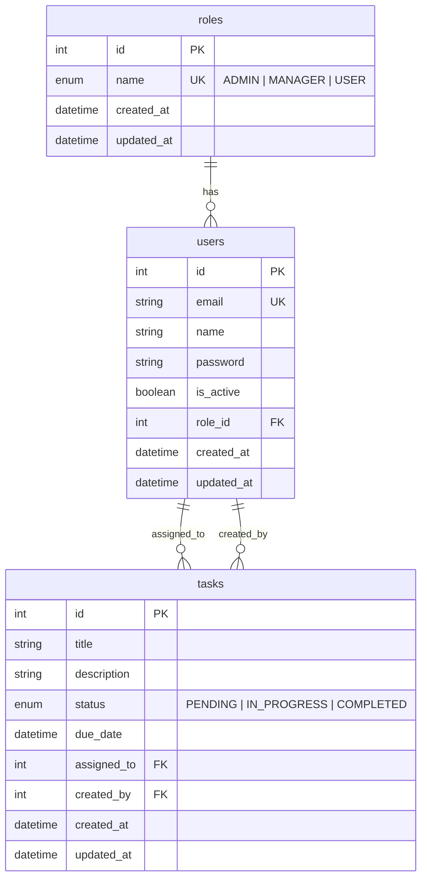

# Database Structure

PostgreSQL database managed with **Alembic** migrations. Initial schema: `alembic/versions/08b8a66e58b2_initialization.py`.

---

## ERD

---

## Tables

### `roles`

| Column       | Type      | Constraints      | Description                   |
| ------------ | --------- | ---------------- | ----------------------------- |
| `id`         | INTEGER   | PK               | Auto-increment                |
| `name`       | ENUM      | UNIQUE, NOT NULL | `ADMIN`, `MANAGER`, or `USER` |
| `created_at` | TIMESTAMP | DEFAULT now()    | Row created                   |
| `updated_at` | TIMESTAMP | DEFAULT now()    | Row updated                   |

Seeded on startup when `SEED_ON_STARTUP=true`.

### `users`

| Column       | Type      | Constraints             | Description      |
| ------------ | --------- | ----------------------- | ---------------- |
| `id`         | INTEGER   | PK                      | Auto-increment   |
| `email`      | VARCHAR   | UNIQUE, NOT NULL, INDEX | Login identifier |
| `name`       | VARCHAR   | NOT NULL                | Display name     |
| `password`   | VARCHAR   | NOT NULL                | bcrypt hash      |
| `is_active`  | BOOLEAN   | DEFAULT true            | Account enabled  |
| `role_id`    | INTEGER   | FK → `roles.id`         | User role        |
| `created_at` | TIMESTAMP | DEFAULT now()           | Row created      |
| `updated_at` | TIMESTAMP | DEFAULT now()           | Row updated      |

Signup defaults `role_id` to the USER role when omitted.

### `tasks`

| Column        | Type      | Constraints               | Description                     |
| ------------- | --------- | ------------------------- | ------------------------------- |
| `id`          | INTEGER   | PK                        | Auto-increment                  |
| `title`       | VARCHAR   | INDEX                     | Task title                      |
| `description` | VARCHAR   | NULL                      | Task details                    |
| `status`      | ENUM      | NOT NULL, DEFAULT PENDING | Workflow state                  |
| `due_date`    | TIMESTAMP | NULL                      | Optional deadline               |
| `assigned_to` | INTEGER   | FK → `users.id`           | Assignee                        |
| `created_by`  | INTEGER   | FK → `users.id`           | Creator (usually manager/admin) |
| `created_at`  | TIMESTAMP | DEFAULT now()             | Row created                     |
| `updated_at`  | TIMESTAMP | DEFAULT now()             | Row updated                     |

There is no separate `assigned_by` column; assignment is tracked via `assigned_to` and `created_by`.

---

## Relationships

| From                | To         | Cardinality | Notes                   |
| ------------------- | ---------- | ----------- | ----------------------- |
| `users.role_id`     | `roles.id` | N:1         | Every user has one role |
| `tasks.assigned_to` | `users.id` | N:1         | Who should do the task  |
| `tasks.created_by`  | `users.id` | N:1         | Who created the task    |

---

## Enums

**`role_name`** (Postgres enum)

- `ADMIN`
- `MANAGER`
- `USER`

**`task_status`** (Postgres enum)

- `PENDING`
- `IN_PROGRESS`
- `COMPLETED`

---
